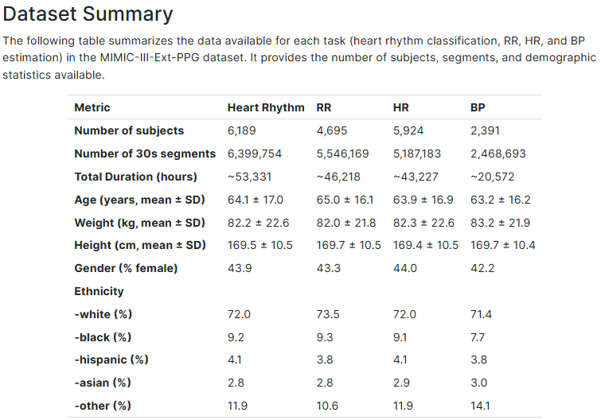

# **Deriving Health Metrics from the Photoplethysmogram: Benchmarks and Insights from MIMIC-III-Ext-PPG**

This is the official code repository for the paper 
**["Deriving Health Metrics from the Photoplethysmogram: Benchmarks and Insights from MIMIC-III-Ext-PPG"](....)** 
by **Mohammad Moulaeifard, Philip J. Aston, Peter Charlton, and Nils Strodthoff**.

---

## **📌 Overview**
This repository contains scripts for training and evaluating AI models on **MIMIC-III-Ext-PPG** dataset. The key objectives of this project include:

---

## **🛠 Step-by-Step Procedure**

### **1. Preprocessing Dataset**
   For each dataset, first generate the corresponding signals.npy and metadata.csv files. You need to download the signals and metadata directly from PhysioNet. Please note that the PhysioNet WFDB signals contain multiple channels, including PPG, ECG, ABP, and RESP. Since this project only required PPG, we extracted the PPG channel from the downloaded WFDB files and converted it into .npy format.

 Summary of the datasets utilized in this study
 

---

### **2. Training Models with PulseDB Subsets**
Once preprocessing is complete, you can train different models.

📌 **Follow the instructions in the Processing section of the repository:**  
🔗 [Training Models](https://github.com/AI4HealthUOL/ppg-ood-generalization/tree/main/Processing)

---

---
📖 Citation
Please consider citing our paper.

---

---
## **📚 References**
📌 **MIMIC-III-Ext-PPG Dataset**  
@article{PhysioNet-mimic-iii-ext-ppg-1.1.0,
  author = {Moulaeifard, Mohammad and Charlton, Peter H and Strodthoff, Nils},
  title = {{MIMIC-III-Ext-PPG: A  PPG Benchmark Dataset for Cardiorespiratory Analysis}},
  journal = {{PhysioNet}},
  year = {2026},
  month = mar,
  note = {Version 1.1.0},
  doi = {10.13026/r6k1-xt76},
  url = {https://doi.org/10.13026/r6k1-xt76}
}
